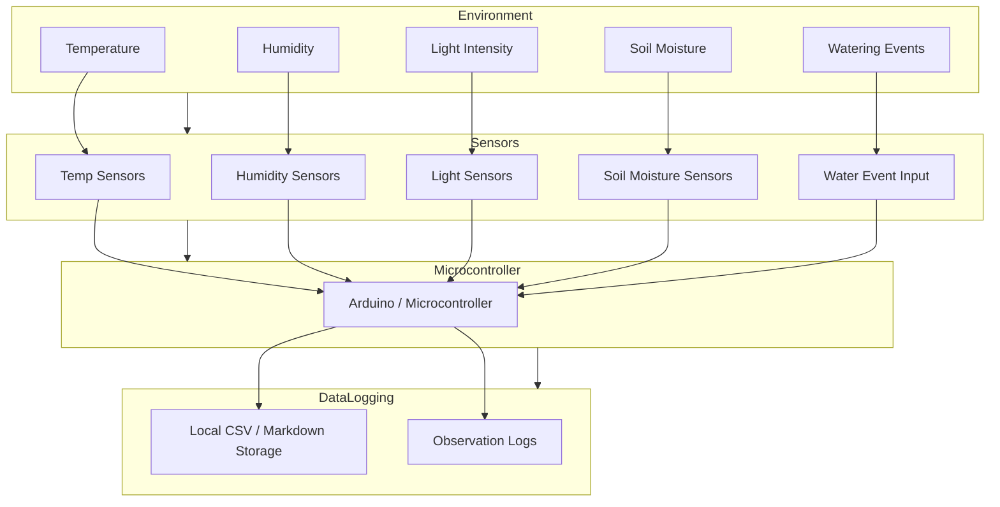
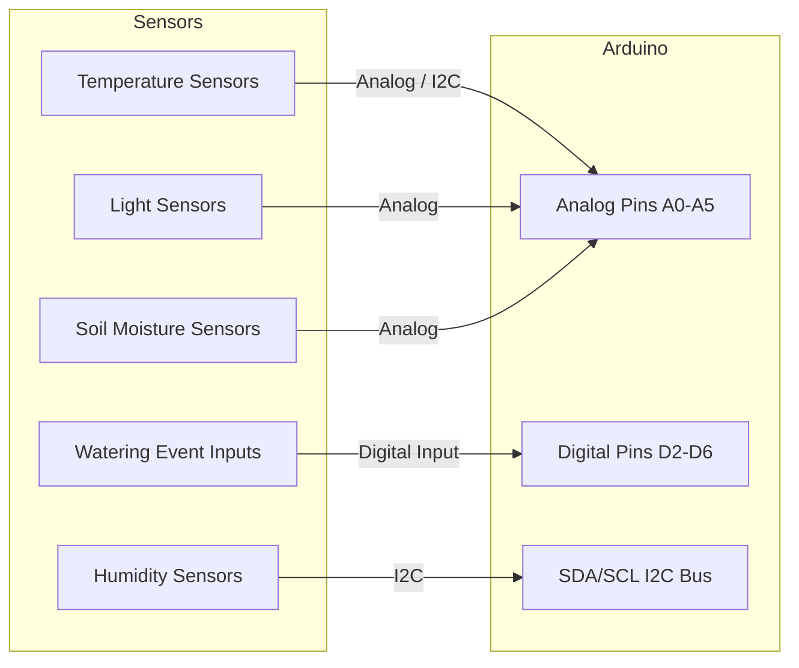

# Phase 1 Sensor Mapping & Diagrams — Bonsai Bio-Cyber System

This document combines **sensor inventory tables** with **Mermaid diagrams** for Phase 1.  
It is fully **DIY-friendly**, Arduino-compatible, and follows Phase 1 governance: observation, learning, and documentation only.

---

## 1. Sensor-to-Pin Table (Requirement-Level)

| Plant | Sensor Type      | Quantity | Connection Type | Conceptual Pin(s) | Notes / Phase 1 Learning Objective |
|-------|-----------------|----------|----------------|-----------------|----------------------------------|
| P1    | Temperature     | 1        | Analog / I²C   | A0 / I2C        | Learn analog reading or I²C addressing |
| P1    | Humidity        | 1        | I²C            | SDA/SCL          | Learn I²C bus sharing and unique addresses |
| P1    | Light Intensity | 1        | Analog          | A1              | Understand analog light measurement |
| P1    | Soil Moisture   | 1        | Analog          | A2              | Practice soil sensor calibration |
| P1    | Watering Event  | 1        | Digital Input   | D2              | Learn event logging (manual or sensor) |
| P2    | Temperature     | 1        | Analog / I²C   | A3 / I2C        | As above |
| P2    | Humidity        | 1        | I²C            | SDA/SCL          | Shared bus, unique address |
| P2    | Light Intensity | 1        | Analog          | A4              | As above |
| P2    | Soil Moisture   | 1        | Analog          | A5              | As above |
| P2    | Watering Event  | 1        | Digital Input   | D3              | As above |
| P3    | Temperature     | 1        | Analog / I²C   | A0 / I2C        | Shared analog pin for planning |
| P3    | Humidity        | 1        | I²C            | SDA/SCL          | As above |
| P3    | Light Intensity | 1        | Analog          | A1              | As above |
| P3    | Soil Moisture   | 1        | Analog          | A2              | As above |
| P3    | Watering Event  | 1        | Digital Input   | D4              | As above |
| P4    | Temperature     | 1        | Analog / I²C   | A3 / I2C        | As above |
| P4    | Humidity        | 1        | I²C            | SDA/SCL          | As above |
| P4    | Light Intensity | 1        | Analog          | A4              | As above |
| P4    | Soil Moisture   | 1        | Analog          | A5              | As above |
| P4    | Watering Event  | 1        | Digital Input   | D5              | As above |
| P5    | Temperature     | 1        | Analog / I²C   | A0 / I2C        | As above |
| P5    | Humidity        | 1        | I²C            | SDA/SCL          | As above |
| P5    | Light Intensity | 1        | Analog          | A1              | As above |
| P5    | Soil Moisture   | 1        | Analog          | A2              | As above |
| P5    | Watering Event  | 1        | Digital Input   | D6              | As above |

---

## 2. System Block Diagram (Mermaid)

---

## 3. Plant Layout with Sensor Placement (Mermaid)

```mermaid
flowchart TD
    P1[Plant 1] -->|Sensors| Temp1[Temp]
    P1 --> Hum1[Humidity]
    P1 --> Light1[Light]
    P1 --> Soil1[Soil Moisture]
    P1 --> Water1[Watering Event]

    P2[Plant 2] --> Temp2[Temp]
    P2 --> Hum2[Humidity]
    P2 --> Light2[Light]
    P2 --> Soil2[Soil Moisture]
    P2 --> Water2[Watering Event]

    P3[Plant 3] --> Temp3[Temp]
    P3 --> Hum3[Humidity]
    P3 --> Light3[Light]
    P3 --> Soil3[Soil Moisture]
    P3 --> Water3[Watering Event]

    P4[Plant 4] --> Temp4[Temp]
    P4 --> Hum4[Humidity]
    P4 --> Light4[Light]
    P4 --> Soil4[Soil Moisture]
    P4 --> Water4[Watering Event]

    P5[Plant 5] --> Temp5[Temp]
    P5 --> Hum5[Humidity]
    P5 --> Light5[Light]
    P5 --> Soil5[Soil Moisture]
    P5 --> Water5[Watering Event]
```

---

## 4. Sensor-to-Pin / Wiring Diagram (Mermaid)

---

## Phase 1 Notes

1. Analog pins may be **shared conceptually** across plants; Phase 2 will finalize assignments or use a larger microcontroller.  
2. I²C sensors share the same bus but require **unique addresses** per sensor.  
3. Watering events use individual digital pins for logging.  
4. Diagrams are **conceptual**; the purpose is **observation, learning, and documentation**, not optimization.  
5. The table + diagrams provide a **single reference** for Phase 1 planning, sensor placement, and pin mapping.
